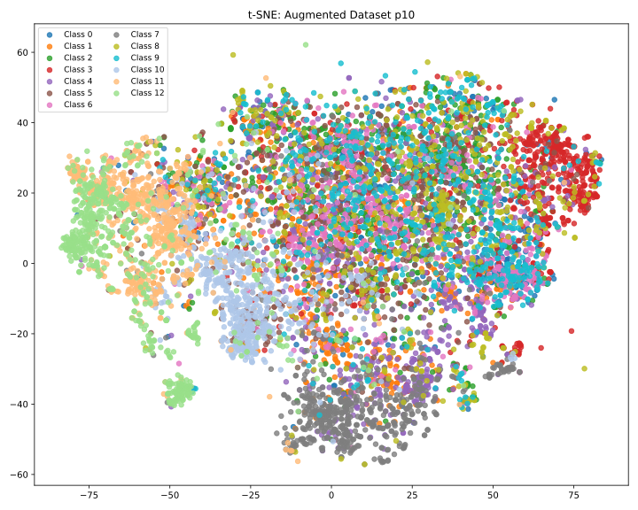

Looking at this t-SNE plot of the real dataset with 13 classes colored distinctly, here are some observations and interpretations:

1. **Clusters with Reasonable Separation**

   * Some classes show visible clusters separated from others. For example:

     * Class 6 (pink) mostly clusters on the left side with some clear grouping.
     * Class 4 (brown) appears somewhat clustered at the bottom center.
     * Class 3 (red) tends to form a loose cluster on the far right.
       This indicates that the embedding space captures some meaningful class-specific features.

2. **Overlapping and Mixed Classes**

   * Many classes overlap heavily in the central area, with dense intermixing of colors like classes 0, 1, 2, 5, 7, 8, 9, 10, 11, and 12.
   * This suggests these classes are either visually similar or the embeddings have difficulty separating them well.
   * It could also mean the features learned by the CLIP model don’t discriminate clearly for these classes, or that the classes are conceptually or visually close.

3. **Tight vs. Loose Clusters**

   * Some clusters are more compact (like classes 4 and 6), indicating consistent visual patterns in those classes.
   * Other classes are more dispersed, meaning their intra-class variability is high or embeddings are noisy.

4. **Possible Class Ambiguity or Dataset Complexity**

   * The substantial overlap and scattered points imply some class boundaries are not well-defined in the feature space.
   * This is common in complex aerial imagery datasets with subtle differences between classes or varying backgrounds.

---

### Summary:

The t-SNE visualization reveals that while some classes are well-separated and form tight clusters, many classes exhibit significant overlap and mixing in the embedding space. This indicates potential challenges in class discrimination for the embedding model or the dataset’s intrinsic complexity.

If you are comparing synthetic data embeddings to this real data, you should expect some degree of overlap but hope that synthetic points at least cluster near their corresponding real class clusters. The overlap also suggests metrics relying on clear class separation may face challenges.

⚠️ This is just an example, not factual